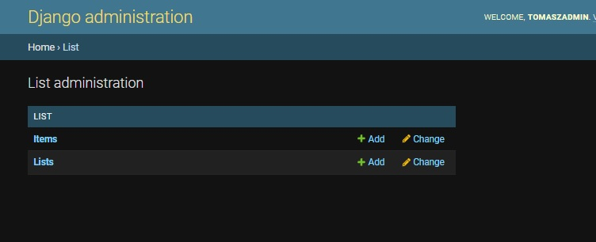
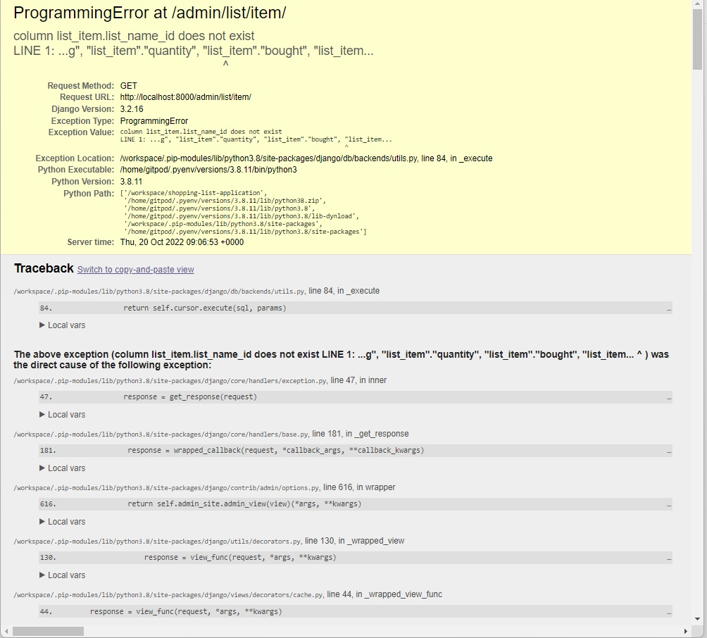
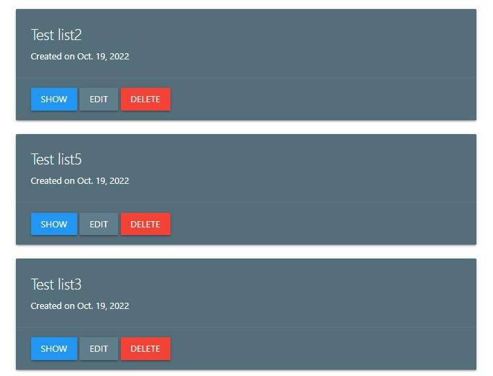
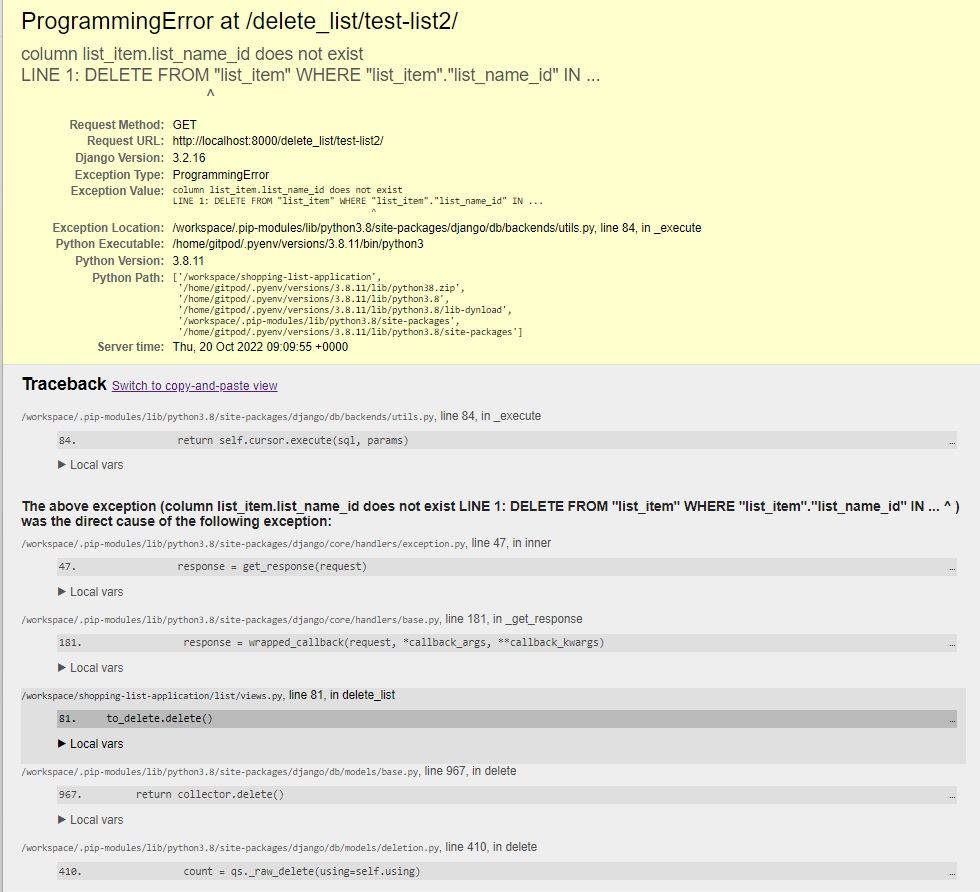
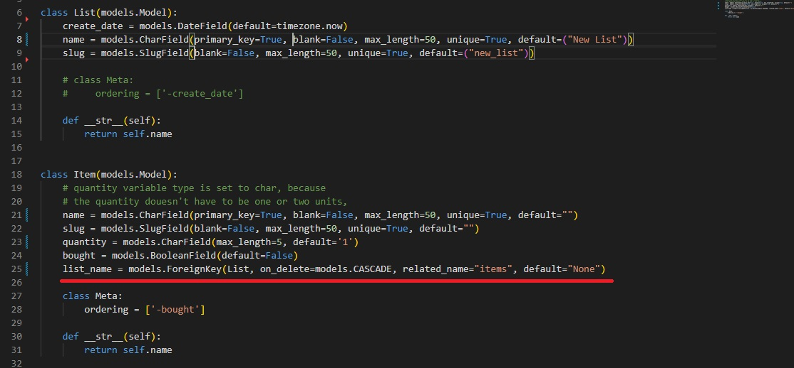
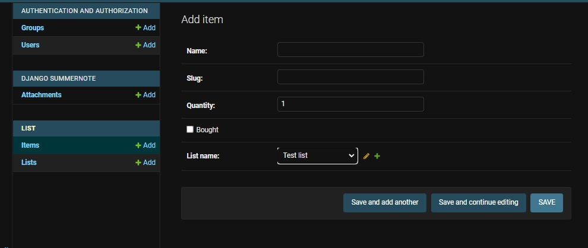
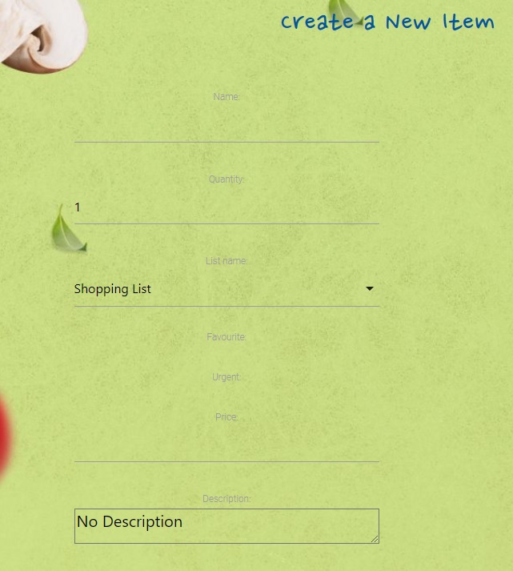

# Shopping List Application

## Overview.

The subject of the project is the web shopping list application. 
The application offers an easy way of adding items to buy, editing and deleting items from the list, as well as marking them as done/bought.
The application also allows the user to register his own account what gives him access to a few useful functions that are accessible only for registered users.

** **
## Contents:
1. [Project Overview](#project-overview)
2. [User Stories](#user-stories)
3. [Features](#features)
    * [Home Page](#home-page)
    * [List class](#list-class)
    * [Item Class](#item-class)
4. [Future Features](#future-features)
5. [Technologies Used](#technologies-used)
6. [Testing](#testing)
7. [Deployment](#deployment)
8. [References and Credits](#references-and-credits)


## User Stories:

### Non-registered user

    - As a non-registered user I would like to be able to create quick and simple shopping list.

    - As a non-registered user I would like to save my shopping list in a database so it will be accessible wherever I am.
    
    - As a non-registered user I would like to mark items as bought, so the bought items will be separated from items to buy.

    - As a non-registered user I would like to mark items as bought, so the bought items will be separated from items to buy.

    - As a non-registered user I would like to edit or delete items.

    - As a non-registered user I would like to clear the list with one click after my shoppings are done, so I don't have to delete each item separately.


### Registered user
    - As a registered user I would like to be able to log in to get access to additional functions.

    - As a registered user I would like to be able to create more than just one list, so I can create separate lists for different occasions and different users.

    - As a registered user I would like to add items to favourite so I can easier add them to my shopping list.

    - As a registered user I would like to be able to mark items as urgent so they can be highlighted on the list and easier spotted.

    - As a registered user I would like to be able to share my list with another users.

    - As a registered user I would like to be able to assign price to items so I can know the assumed price of all items on the list.

    - As a registered user I would like to be able to print the shopping list, so I can use the list when I have no mobile devices with me.


### As the application creator:
    - I want to make the application user friendly
    - I want the application to be free from bugs and errors.

<!-- - **Must do:**
    - Create class Item and the model section for Items.
    - Add, edit, delete item functions.
    - Marking item as bought and sorting the list.
    - Register and Login/logout functions that allow the register user to get access to additional functions (more about additional functions in the Could do section)
    - Create a table in Postgres database for added items that will contain Columns for: Id, Name, quantity, urgent, bought.
    - Adding each item to the list in Database, so they can be suggested during the future search.
    - Create a responsive layout with Materialize, Bootstrap or Material Desing Bootstrap.
    - Create a separate templates for each CRUD function that will inherit from the base template.
    - Deploy to Heroku. Create Procfile and Requirements.txt file.
    
- **Could do:**
    - Add additional columns for Item attributes such as: price, favorite.
    - Add item to the favourite. Create the Favourite Item column in Database. Favorite item suggested during the search and have predefined price.


- ***Additional Item's attributtes available only for register users***

    - Favorite. Favorite item could be suggested during the search and it can have a predefined price.
    - Price: Summed up value of all items could be displayed at the bottom of the list.
    - Category that will contain different icons for each category
    - Shopping counter showing how many times the item was added to the shopping list. -->

## Project Overview


## Features

The application includes following sections. Although accessibilty of those sections depends on whether the user is logged in or not.

### **Home Page**
Home Page contain a short introduction to the application.
In case of unlogged in user it displays a default Shopping List where the user can add, delete or update the list. 
In case of logged in user the Home Page displays last three list previously created by the user. There is also a button which redirects the user to the lists page where he can add more list and to manage already existing lists.

### **Lists Page**
This page is only accessible for logged in users and it allows users to create new lists and to manage existing lists.

### **Items Page**
This page is only accessible for logged in users and it allows users to create new items and to edit or delete items, as well as assigning items to lists.

### **Header** this section contains the list of events taking place in 

### **Navigation bar**
  All sections are clearly and simply arranged inside the navigation bar which allows for an easy access to each section. 

### **Shopping List Section** 

### **Login/logout Section** 

### **Footer**  


- **Add Item** 

- **Item Section** 
    Contains information about item that is added to the shopping list.

## List Class:
    List class contains attributes such as: name and create_date, also it contains a variable of type slug.
```
    class List(models.Model):
        create_date = models.DateField(default=timezone.now)
        name = models.CharField(blank=False, max_length=50, unique=True, default=("New List"))
        slug = models.SlugField(blank=False, max_length=50, unique=True, default=("new_list"))
```

## Item class:
    Item class is the basic shopping list item, it is available to every user without the necessity of createing an account. 
```
    class Item(models.Model):
        name = models.CharField(blank=False, max_length=50, unique=True, default="")
        slug = models.SlugField(blank=False, max_length=50, unique=True, default="")
        quantity = models.CharField(max_length=5, default='1')
        bought = models.BooleanField(default=False)
        list_name = models.ForeignKey(List, on_delete=models.CASCADE, related_name="items", default="None")
```

    The class contains only the most needed elements such as items name and quantity. 
    Slug variable is generated automatically based on the items name.
    List name is the Foreign Key and it defines which Shopping List the item is assigned to. In case of the unregistered user this value is set to the default Shopping List.
    bought variable is a boolean value set by the user with the "Mark as bought" toggle button.


## ItemExtended Class:

    This is an extended version of the Item class that is available to the users that are registered and logged in compare to the basic Items class the extended Items contain a few additional elements

```
    class ItemExtended(models.Model):
        name = models.CharField(blank=False, max_length=50, unique=True, default="")
        slug = models.SlugField(blank=False, max_length=50, unique=True, default="")
        quantity = models.CharField(max_length=5, default='1')
        bought = models.BooleanField(default=False)
        list_name = models.ForeignKey(List, on_delete=models.CASCADE, related_name="itemsextended", default="None")

        favourite = models.BooleanField(default=False)
        urgent = models.BooleanField(default=False)
        price = models.DecimalField(max_digits=6, decimal_places=2)
        description = models.TextField(blank=True, null=True, default="No Description")
```

    Favourite - allows to mark the item as favourite.
    Urgent - allows to mark the items as Urgent. ?????????????????????????????????
    Prize - allows the user to assign the prize of the item what in the future will allow to calculate the extimated value all the items on the list.

## Future Features

    - Function that allows to calculate the value of all items on the shopping list based on it prices.

## Technologies used:
    * Python - an interpreted, object-oriented, high-level programming language.
    * Django - Framework facilitating building full stack web application.
    * Django allauth - an authentication module that allows account authentication, registration and management.
    * Materialize - A design language that simplifies bulding front end templates with use of ready made components.
    * Javascript - High-level programming language.
    * HTML5 - Markup language used to make webpages.
    * CSS3 - A language used to style HTML and XHTML documents presentations in web development.
    * Gitpod - Online integrated development environment.
    * GitHub - Version control service used for storing and sharing development projects.
    * Heroku - a container-based cloud platform where developers can deploy their projects.

## Testing

## Bugs and Errors

### Model Error
When I click on items list, instead of diplaying the items list I get an error:

ProgrammingError at /admin/list/item/
column list_item.list_name_id does not exist
LINE 1: ...g", "list_item"."quantity", "list_item"."bought", "list_item...





The same thing happens when I try to delete any list in my application.





The source of the error seems to be the underlined line of code, where I try to assign the Item object to a List. 
I try to use List as the foreign key, but the system expects to find list_name_id




P.S. Item model displays in the admin panel when I click the 'add' button, but when I try to 'save' the Item the error mentioned above show up.



    ### Checkbox issue



## Deployment

### Local Deployment

## References and Credits:

- Tutorial on differences between MVC and MVT - https://www.youtube.com/watch?v=zhrLVCjNbyk

- Vibhor Chandels YouTube channel on Agile methodology - https://www.youtube.com/watch?v=C2boBomE4aM&list=PLxO4vxvvorbtqmkL7sYi0Qc4kX-0RE9fp
- Mark Shead YouTube channel on Agile -  https://www.youtube.com/c/MarkShead

- How to create Modals using Materialize YouTube tutorial - https://www.youtube.com/watch?v=GAQoVIgjeZA&list=TLPQMjkxMDIwMjJbjtPeibmcMA&index=2

- How to create a nice login form using Materialize YouTube tutorial - https://www.youtube.com/watch?v=2lbiRNNnAx8&t=1s

- Solution how to fix not displaying checkboxes in materialize - https://stackoverflow.com/questions/54500348/django-checkbox-not-showing-up-in-html

## Credits: