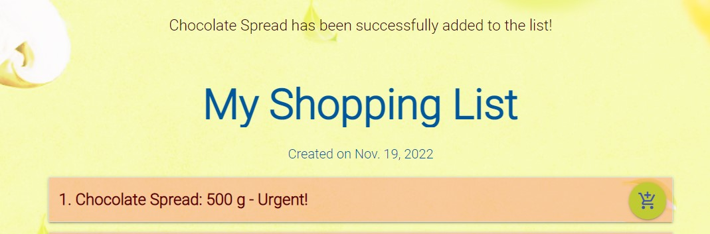

# Shopping List Application


## 1. Overview.

Portfolio Porject 4.
The subject of the project is the web shopping list application. 
This is a very simple and easy to use application that offers the user few basic functionalities, such as to create, add and manage items. 
It also allows the user to register his own account what gives him an access to addintional useful functions that are accessible only for registered users.


## Contents:
1. [Project Overview](#1-overview)
2. [User Stories](#2-user-stories)
3. [Features](#3-features)
    * [Home Page](#home-page)
    * [List Page](#lists-page)
    * [Shopping List View](#shopping-list-page)
    * [Add Item](#add-item)
    * [Edit Item](#edit-item)
    * [Register, Login/logout](#register-loginlogout-pages)
    * [List class](#list-class)
    * [Item Class](#item-class)
4. [Future Features](#4-future-features)
5. [Technologies Used](#5-technologies-used)
6. [Testing](#6-testing)
7. [Bugs and Error](#7-bugs-and-errors)
7. [Deployment](#8-deployment)
8. [References and Credits](#9-references-and-credits)


## **2. User Stories:**


- As a user I would like to be able to create quick and simple shopping list.

- As a user I would like to save my shopping list in a database so it will be accessible wherever I am.

- As a user I would like to mark items as bought, so the bought items will be separated from items to buy.

- As a user I would like to mark items as bought, so the bought items will be separated from items to buy.

- As a user I would like to edit or delete items.

- As a user I would like to clear the list with one click after my shoppings are done, so I don't have to delete each item separately.

- As a registered user I would like to be able to log in to get access to additional functions.

- As a user I would like to be able to create more than just one list, so I can create separate lists for different occasions and different users.

- As a user I would like to add items to favourite so I can easier add them to my shopping list.

- As a user I would like to be able to mark items as urgent so they can be highlighted on the list and easier spotted.

- As a user I would like to be able to share my list with another users.

- As a user I would like to be able to assign price to items so I can know the assumed price of all items on the list.

- As a registered user I would like to be able to print the shopping list, so I can use the list when I have no mobile devices with me.


### **As the application creator:**
- I want the application to be friendly and easy to user. 
- I want the application to be free from bugs and errors.


## **3. Features**
The application is made of three main sections:
- Home Page.
- Lists section.
- Lists items view.
- Register and Login/logout sections.
The application includes following sections.


### **Home Page**
Home Page contain a short introduction to the application.

In case of logged in user the Home Page displays last three list previously created by the user. There is also a button which redirects the user to the lists page where he can add more list and to manage already existing lists.


#### **Navigation bar**
All sections are clearly and simply arranged inside the navigation bar which allows for an easy access to applications section depending on whether the user is logged in or not.

Not logged in users view.


The top navbar is hoverable and it fades out when it is not used.


Logged in users view. When the user logs in additional function shows on the navbar.


The navigation bar is fully responsive and it adjusts to the screen size.
In smaller devices such tablets and mobile phones the all the buttons are move to the side navigation bar.


#### **Side Navigation Bar**
In smaller size devices the navigation bar buttons are moved to the pop up side bar.

Not logged in users view.


Logged in users view.


#### **Footer**  
Contains informations about copyrights and link to the Code Institude web page.


### **Lists Page**
This page is only accessible for logged in users and it allows users to create new lists and to manage existing lists.


### **Shopping List Page**


This section displays items added to the list. It also allows to add new Items by cliking Add Item Button or to edit existing Items by clicking Edit Item Button:

In this section the user can also click the green round button:


to mark the item as bought. Marked item is automatically moved to bought items list which is placed below the Items To Buy list.


A bought item can be unmarked and it returns to the items to buy list.


### **Item View**

Left-click on the item element drop-down menu, where the user can update or delete the item.
More information about editing items [here](#edit-item)


### **Create a new list**


### **Edit list**

To change the name of a list click Edit button.


### **Delete list**

To delete an existing List click Delete button. After approving that you want to delete the List, the list and its content will be removed from the applications memory.


### **Add Item**
This section displays a form that allows creating and adding a new item to the list.



Filling up the form and clicking the Add Item button results with adding the new item to the shopping list.


More information about Item classes available in the right section below or [here](#item-class)


### **Edit Item**
This function allows user to edit items name as well as other values.
Not logged in user has only access to two values: Name and items quantity.


By clicking **Submit Changes** button new values will be submitted and displayed in the updated list view.


## **Register, Login/logout Pages** 
Register page display a form where the user can create an account.
After filling up the form where the user has to enter his user name, email and password. The account will be created and ready to use.


Login Page allows the user to login to his account what will give him access to all applications functions.


## **About Page** 


## **List Class:**
List class contains attributes such as: name and create_date, also it contains a variable of type slug.
```python
    class List(models.Model):
        list_owner = models.ForeignKey(User, on_delete=models.CASCADE)
        create_date = models.DateField(default=timezone.now)
        name = models.CharField(blank=False, max_length=30)
        slug = models.SlugField(blank=False, max_length=30)
```
List owner - the logged in user who the list belongs to.

Create date - Date when the list was created.

Name - Lists name.

Slug variable is generated automatically based on the items name.


## **Item class:**

Item class is the basic shopping list item.

The class contains elements such as items name and quantity. 

Slug variable is generated automatically based on the items name.

List name is the Foreign Key and it defines which Shopping List the item is assigned to. 

bought variable is a boolean value set by the user with the "Mark as bought" toggle button.

Favourite - allows to mark the item as favourite.

Urgent - allows to mark the items as Urgent. ?????????????????????????????????

Prize - allows the user to assign the prize of the item what in the future will allow to calculate the extimated value all the items on the list.

Description - Allow to add short description to each item.

```python
    class Item(models.Model):
        name = models.CharField(blank=False, max_length=50)
        slug = models.SlugField(blank=False, max_length=50)
        quantity = models.CharField(max_length=7, default='1')
        bought = models.BooleanField(default=False)
        list_name = models.ForeignKey(
            List, on_delete=models.CASCADE, related_name="items")
        favourite = models.BooleanField(default=False)
        urgent = models.BooleanField(default=False)
        price = models.DecimalField(
            max_digits=6, decimal_places=2, null=True, blank=True)
        description = models.TextField(blank=True, null=True, default="")
```


## **4. Future Features**

- Add a function to share a shopping list with other users.
- Delete account function.
- Function that allows to calculate the value of all items on the shopping list based on it prices.
- Adding profile photos to the side navigation bar.
- Style the side navbar, add 


## **5. Technologies used:**

* Python - an interpreted, object-oriented, high-level programming language.
* Django - Framework facilitating building full stack web application.
* Django allauth - an authentication module that allows account authentication, registration and management.
* Materialize - A design language that simplifies bulding front end templates with use of ready made components.
* Javascript - High-level programming language.
* HTML5 - Markup language used to make webpages.
* CSS3 - A language used to style HTML and XHTML documents presentations in web development.
* Gitpod - Online integrated development environment.
* GitHub - Version control service used for storing and sharing development projects.
* Heroku - a container-based cloud platform where developers can deploy their projects.
* Cloudinary - Cloud platform I used for uploding and storing images used in this Project.

## **6. Testing**

The applications code was tested using Pep8 code validator: http://pep8online.com/. More details about tesings are available in the dedicated testing section testing.md [here](TESTING.md).

## **7. Bugs and Errors**

A number of bugs and error occured during the developement 

### **Checkbox issue**

A problem occured when I tried to display forms using Materialize templates. 
The template did not display checkboxes correctly in all of my forms.


The solution turned out to be instaling Material and displaying the forms as Material forms:


You can find more detail about how to fix this bug here: https://stackoverflow.com/questions/54500348/django-checkbox-not-showing-up-in-html


### **Integrity Error**

A problem occured during updating items and lists.
Edit Items function doesn't update the elements slug.
So if you update items name from item1 to item2, the items slug will still be item1.
If you try to add a new item named item1 it will cause Integrity Error beacuse of duplicating slugs.


I've temporarily solved the problem with handling the error with try/catch statement. 
It would be useful to add slugs update functionality to Edit Items and Edit Lists functions.

```python
try:
    if item_form.is_valid():
        item_form.instance.slug = slugify(request.POST.get("name"))
        item_form.instance.list_name = list
        item_form.save()
        return redirect(reverse("show_list_items", args=[list.slug]))
    except IntegrityError as e:
        messages.error(request, f"Sorry! A problem occured. Please choose another name for this item.")
```


### Not Found Favicon.ico


Not found favicon.ico status 404 shows during the start of the application.
Have solved this problem following the instruction I found in Stack Overflow:
https://stackoverflow.com/questions/31075893/im-getting-favicon-ico-error

### Not Found Robots.txt


Not found robots.txt show during tha Lighthouse inspection.

## **8. Deployment**

The live deployed application can be found on [Heroku](https://tw-shopping-list.herokuapp.com).

### Heroku Deployment

This project uses [Heroku](https://www.heroku.com), a platform as a service (PaaS) that enables developers to build, run, and operate applications entirely in the cloud.

Deployment steps are as follows, after account setup:

- Select *New* in the top-right corner of your Heroku Dashboard, and select *Create new app* from the dropdown menu.
- Your app name must be unique, and then choose a region closest to you (EU or USA), and finally, select *Create App*.
- From the new app *Settings*, click *Reveal Config Vars*, and set the following key/value pairs:
  - `CLOUDINARY_URL` (insert your own Cloudinary API key here)
  - `DATABASE_URL` (this comes from the **Resources** tab, you can get your own Postgres Database using the Free Hobby Tier)
  - `SECRET_KEY` (this can be any random secret key)
  - `PORT` (8000)

Heroku needs two additional files in order to deploy properly.
- requirements.txt
- Procfile

You can install this project's requirements (where applicable) using: `pip3 install -r requirements.txt`.
If you have your own packages that have been installed, then the requirements file needs updated using: `pip3 freeze --local > requirements.txt`

The Procfile can be created with the following command: `echo web: gunicorn shoppinglist.wsgi > Procfile`

For Heroku deployment, follow these steps to connect your GitHub repository to the newly created app:

Either:
- Select "Automatic Deployment" from the Heroku app.

Or:
- In the Terminal/CLI, connect to Heroku using this command: `heroku login -i`
- Set the remote for Heroku: `heroku git:remote -a <app_name>` (replace app_name with your app, without the angle-brackets)
- After performing the standard Git `add`, `commit`, and `push` to GitHub, you can now type: `git push heroku main`

The frontend terminal should now be connected and deployed to Heroku.

### Local Deployment

*Gitpod* IDE was used to write the code for this project.

You can clone the repository by following these steps:

1. Go to the [GitHub repository](https://github.com/TomaszWoloszyn983/shopping-list-application) 
2. Locate the Code button above the list of files and click it 
3. Select if you prefer to clone using HTTPS, SSH, or GitHub CLI and click the copy button to copy the URL to your clipboard
4. Open Git Bash or Terminal
5. Change the current working directory to the one where you want the cloned directory
6. In your IDE Terminal, type the following command to clone my repository:
	- `git clone https://github.com/TomaszWoloszyn983/shopping-list-application.git`
7. Press Enter to create your local clone.

You can install this project's requirements (where applicable) using: `pip3 install -r requirements.txt`.

You will need to create a new file called `env.py`, and include the same environment variables listed above for Heroku deployment steps.

Alternatively, if using Gitpod, you can click below to create your own workspace using this repository.

[](https://gitpod.io/#https://github.com/TomaszWoloszyn983/shopping-list-application)


## **9. References and Credits:**

- The background image was created with Canva - Free Design Tool - https://www.canva.com/pl_pl/

- Article on robots.txt file - https://sitechecker.pro/site-audit-issues/robots-txt-not-found/

- Stack overflow topic how to fix favicon.ico error - https://stackoverflow.com/questions/31075893/im-getting-favicon-ico-error

- Tutorial on differences between MVC and MVT - https://www.youtube.com/watch?v=zhrLVCjNbyk

- Vibhor Chandels YouTube channel on Agile methodology - https://www.youtube.com/watch?v=C2boBomE4aM&list=PLxO4vxvvorbtqmkL7sYi0Qc4kX-0RE9fp
- Mark Shead YouTube channel on Agile -  https://www.youtube.com/c/MarkShead

- How to create Modals using Materialize YouTube tutorial - https://www.youtube.com/watch?v=GAQoVIgjeZA&list=TLPQMjkxMDIwMjJbjtPeibmcMA&index=2

- How to create a nice login form using Materialize YouTube tutorial - https://www.youtube.com/watch?v=2lbiRNNnAx8&t=1s

- Solution how to fix not displaying checkboxes in materialize - https://stackoverflow.com/questions/54500348/django-checkbox-not-showing-up-in-html

- Sidebar background image: https://creator.nightcafe.studio/u/575RyajOr4V9EM3umpmEZLfLS2w1

## **10. Credits:**