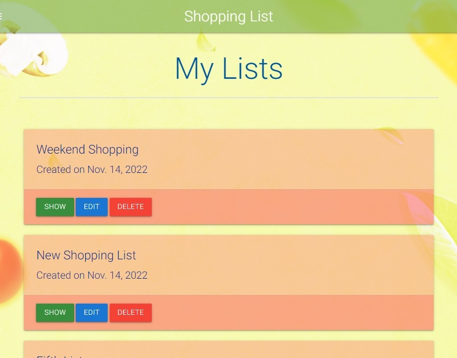
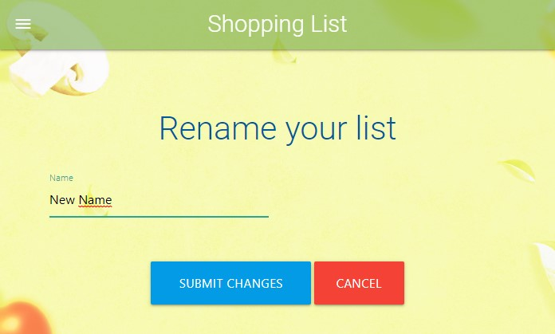

# Shopping List Application

## Overview.

The subject of the project is the web shopping list application. 
The application offers an easy way of adding items to buy, editing and deleting items from the list, as well as marking them as done/bought.
The application also allows the user to register his own account what gives him access to a few useful functions that are accessible only for registered users.


## Contents:
1. [Project Overview](#project-overview)
2. [User Stories](#user-stories)
3. [Features](#features)
    * [Home Page](#home-page)
    * [List Page](#lists-page)
    * [Shopping List View](#shopping-list-page)
    * [Add Item](#add-item)
    * [Edit Item](#edit-item)
    * [Item Page](#items-page)
    * [List class](#list-class)
    * [Item Class](#item-class)
4. [Future Features](#future-features)
5. [Technologies Used](#technologies-used)
6. [Testing](#testing)
7. [Deployment](#deployment)
8. [References and Credits](#references-and-credits)


## **User Stories:**

### **Non-registered user**

- As a non-registered user I would like to be able to create quick and simple shopping list.

- As a non-registered user I would like to save my shopping list in a database so it will be accessible wherever I am.

- As a non-registered user I would like to mark items as bought, so the bought items will be separated from items to buy.

- As a non-registered user I would like to mark items as bought, so the bought items will be separated from items to buy.

- As a non-registered user I would like to edit or delete items.

- As a non-registered user I would like to clear the list with one click after my shoppings are done, so I don't have to delete each item separately.


### **Registered user**
- As a registered user I would like to be able to log in to get access to additional functions.

- As a registered user I would like to be able to create more than just one list, so I can create separate lists for different occasions and different users.

- As a registered user I would like to add items to favourite so I can easier add them to my shopping list.

- As a registered user I would like to be able to mark items as urgent so they can be highlighted on the list and easier spotted.

- As a registered user I would like to be able to share my list with another users.

- As a registered user I would like to be able to assign price to items so I can know the assumed price of all items on the list.

- As a registered user I would like to be able to print the shopping list, so I can use the list when I have no mobile devices with me.


### **As the application creator:**
- I want to make the application user friendly
- I want the application to be free from bugs and errors.

<!-- - **Must do:**
    - Create class Item and the model section for Items.
    - Add, edit, delete item functions.
    - Marking item as bought and sorting the list.
    - Register and Login/logout functions that allow the register user to get access to additional functions (more about additional functions in the Could do section)
    - Create a table in Postgres database for added items that will contain Columns for: Id, Name, quantity, urgent, bought.
    - Adding each item to the list in Database, so they can be suggested during the future search.
    - Create a responsive layout with Materialize, Bootstrap or Material Desing Bootstrap.
    - Create a separate templates for each CRUD function that will inherit from the base template.
    - Deploy to Heroku. Create Procfile and Requirements.txt file.
    
- **Could do:**
    - Add additional columns for Item attributes such as: price, favorite.
    - Add item to the favourite. Create the Favourite Item column in Database. Favorite item suggested during the search and have predefined price.


- ***Additional Item's attributtes available only for register users***

    - Favorite. Favorite item could be suggested during the search and it can have a predefined price.
    - Price: Summed up value of all items could be displayed at the bottom of the list.
    - Category that will contain different icons for each category
    - Shopping counter showing how many times the item was added to the shopping list. -->


## **Features**
The application includes following sections. Although accessibilty of those sections depends on whether the user is logged in or not.


### **Home Page**
Home Page contain a short introduction to the application.
In case of unlogged in user it displays a default Shopping List where the user can add, delete or update the list. 
In case of logged in user the Home Page displays last three list previously created by the user. There is also a button which redirects the user to the lists page where he can add more list and to manage already existing lists.


#### **Navigation bar**
All sections are clearly and simply arranged inside the navigation bar which allows for an easy access to applications section depending on whether the user is logged in or not.

Not logged in users view.


The top navbar is hoverable and it fades out when it is not used.


Logged in users view. When the user logs in additional function shows on the navbar.


The navigation bar is fully responsive and it adjusts to the screen size.
In smaller devices such tablets and mobile phones the all the buttons are move to the side navigation bar.


#### **Side Navigation Bar**
In smaller size devices the navigation bar buttons are moved to the pop up side bar.

Not logged in users view.


Logged in users view.


#### **Footer**  
Contains informations about copyrights and link to the Code Institude web page.


### **Lists Page**
This page is only accessible for logged in users and it allows users to create new lists and to manage existing lists.



### **Shopping List Page**


This section displays items added to the list. It also allows to add new Items by cliking Add Item Button or to edit existing Items by clicking Edit Item Button:

In this section the user can also click the green round button:


to mark the item as bought. Marked item is automatically moved to bought items list which is placed below the Items To Buy list.


A bought item can be unmarked and it returns to the items to buy list.


# !!! *SOme screenshots of Add Edit and Delete button* !!!


### **Create a new list**


### **Edit list**

To change the name of a list click Edit button.




### **Delete list**

To delete an existing List click Delete button. After approving that you want to delete the List, the list and its content will be removed from the applications memory.


### **Add Item**
This section displays a form that allows creating and adding a new item to the list.
Views of this templeted vary depending on whether the user is logged in or not.

For not logged in users it will look as follows


Whereas the version for logged in users contains more informations about items.


Filling up the form and clicking the Add Item button results with adding the new item to the shopping list.


More information about Item classes available in the right section below or [here](#item-class)


### **Edit Item**
This function allows user to edit items Name as well as other values.

## **Items Page**
This page is only accessible for logged in users and it allows users to create new items and to edit or delete items, as well as assigning items to lists.


## **Login/logout Section** 


## **List Class:**
List class contains attributes such as: name and create_date, also it contains a variable of type slug.
```
    class List(models.Model):
        create_date = models.DateField(default=timezone.now)
        name = models.CharField(blank=False, max_length=50, unique=True, default=("New List"))
        slug = models.SlugField(blank=False, max_length=50, unique=True, default=("new_list"))
```


## **Item class:**

    Item class is the basic shopping list item, it is available to every user without the necessity of creating an account. 

```
    class Item(models.Model):
        name = models.CharField(blank=False, max_length=50, unique=True, default="")
        slug = models.SlugField(blank=False, max_length=50, unique=True, default="")
        quantity = models.CharField(max_length=5, default='1')
        bought = models.BooleanField(default=False)
        list_name = models.ForeignKey(List, on_delete=models.CASCADE, related_name="items", default="None")
```

    The class contains only the most needed elements such as items name and quantity. 
    Slug variable is generated automatically based on the items name.
    List name is the Foreign Key and it defines which Shopping List the item is assigned to. In case of the unregistered user this value is set to the default Shopping List.
    bought variable is a boolean value set by the user with the "Mark as bought" toggle button.


## **ItemExtended Class:**

    This is an extended version of the Item class that is available to the users that are registered and logged in compare to the basic Items class the extended Items contain a few additional elements

```
    class ItemExtended(models.Model):
        name = models.CharField(blank=False, max_length=50, unique=True, default="")
        slug = models.SlugField(blank=False, max_length=50, unique=True, default="")
        quantity = models.CharField(max_length=5, default='1')
        bought = models.BooleanField(default=False)
        list_name = models.ForeignKey(List, on_delete=models.CASCADE, related_name="itemsextended", default="None")

        favourite = models.BooleanField(default=False)
        urgent = models.BooleanField(default=False)
        price = models.DecimalField(max_digits=6, decimal_places=2)
        description = models.TextField(blank=True, null=True, default="No Description")
```
Favourite - allows to mark the item as favourite.
Urgent - allows to mark the items as Urgent. ?????????????????????????????????
Prize - allows the user to assign the prize of the item what in the future will allow to calculate the extimated value all the items on the list.


## **Future Features**

- Add a function to share a shopping list with other users.
- Function that allows to calculate the value of all items on the shopping list based on it prices.
- Adding profile photos to the side navigation bar.


## **Technologies used:**

* Python - an interpreted, object-oriented, high-level programming language.
* Django - Framework facilitating building full stack web application.
* Django allauth - an authentication module that allows account authentication, registration and management.
* Materialize - A design language that simplifies bulding front end templates with use of ready made components.
* Javascript - High-level programming language.
* HTML5 - Markup language used to make webpages.
* CSS3 - A language used to style HTML and XHTML documents presentations in web development.
* Gitpod - Online integrated development environment.
* GitHub - Version control service used for storing and sharing development projects.
* Heroku - a container-based cloud platform where developers can deploy their projects.

## **Testing**

The applications code was tested using Pep8 code validator: http://pep8online.com/. More details about tesings are available in the dedicated testing section testing.md [here](TESTING.md).

## **Bugs and Errors**

A number of bugs and error occured during the developement 

### **Checkbox issue**

A problem occured when I tried to display forms in Materialize templates. 
The template did not display checkboxes correctly in all of my forms.


The solution turned out to be instaling Material and displaying the forms as Material forms:


You can find more detail about how to fix this bug here: https://stackoverflow.com/questions/54500348/django-checkbox-not-showing-up-in-html


### **Integrity Error**

A problem occured during updating items and lists.
Edit Items function doesn't update the elements slug.
So if you update items name from item1 to item2, the items slug will still be item1.
If you try to add a new item named item1 it will cause Integrity Error beacuse of duplicating slugs.


I've temporarily solved the problem with handling the error with try/catch statement. 
It would be useful to add slugs update functionality to Edit Items and Edit Lists functions.

```
try:
    if item_form.is_valid():
        item_form.instance.slug = slugify(request.POST.get("name"))
        item_form.instance.list_name = list
        item_form.save()
        return redirect(reverse("show_list_items", args=[list.slug]))
    except IntegrityError as e:
        messages.error(request, f"Sorry! A problem occured. Please choose another name for this item.")
```


## **Deployment**

### **Local Deployment**

## **References and Credits:**

- The background image was created with Canva - Free Design Tool - https://www.canva.com/pl_pl/

- Article on robots.txt file - https://sitechecker.pro/site-audit-issues/robots-txt-not-found/

- Stack overflow topic how to fix favicon.ico error - https://stackoverflow.com/questions/31075893/im-getting-favicon-ico-error

- Tutorial on differences between MVC and MVT - https://www.youtube.com/watch?v=zhrLVCjNbyk

- Vibhor Chandels YouTube channel on Agile methodology - https://www.youtube.com/watch?v=C2boBomE4aM&list=PLxO4vxvvorbtqmkL7sYi0Qc4kX-0RE9fp
- Mark Shead YouTube channel on Agile -  https://www.youtube.com/c/MarkShead

- How to create Modals using Materialize YouTube tutorial - https://www.youtube.com/watch?v=GAQoVIgjeZA&list=TLPQMjkxMDIwMjJbjtPeibmcMA&index=2

- How to create a nice login form using Materialize YouTube tutorial - https://www.youtube.com/watch?v=2lbiRNNnAx8&t=1s

- Solution how to fix not displaying checkboxes in materialize - https://stackoverflow.com/questions/54500348/django-checkbox-not-showing-up-in-html

- Sidebar background image: https://creator.nightcafe.studio/u/575RyajOr4V9EM3umpmEZLfLS2w1

## **Credits:**