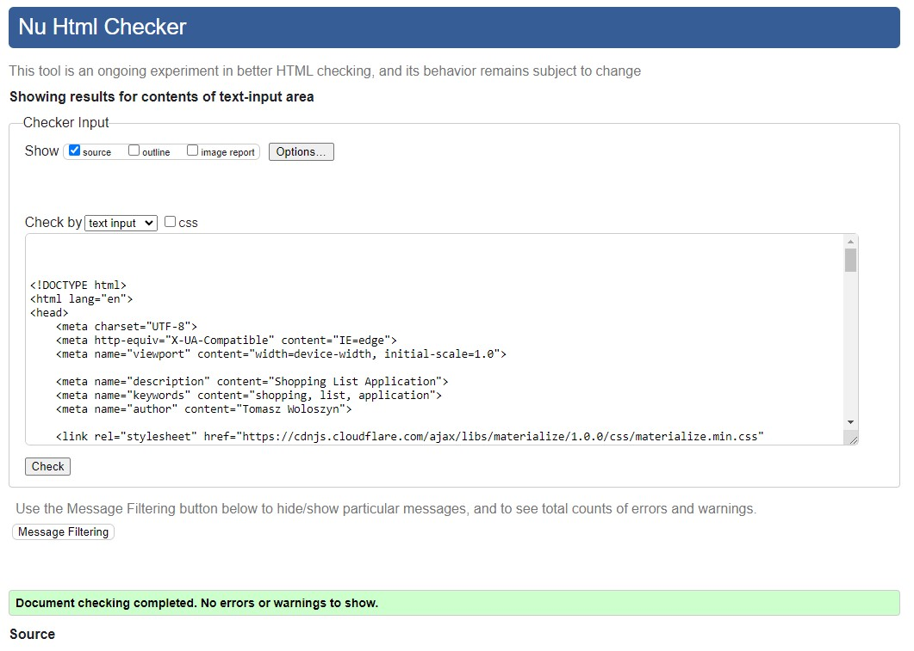
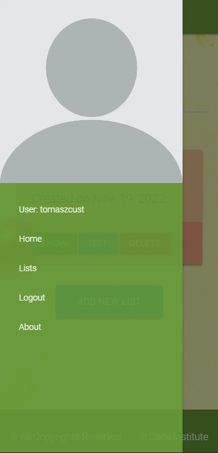
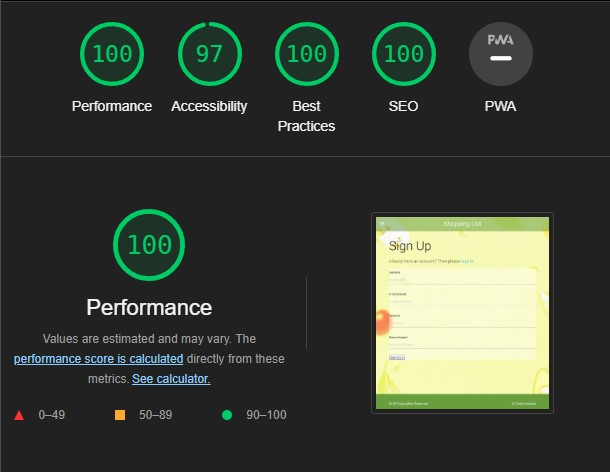
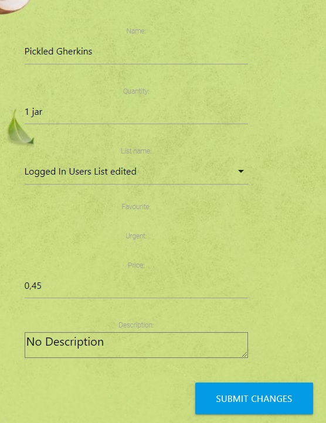
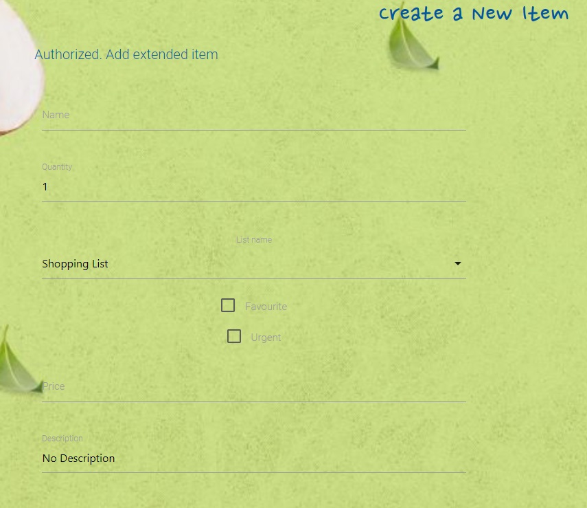
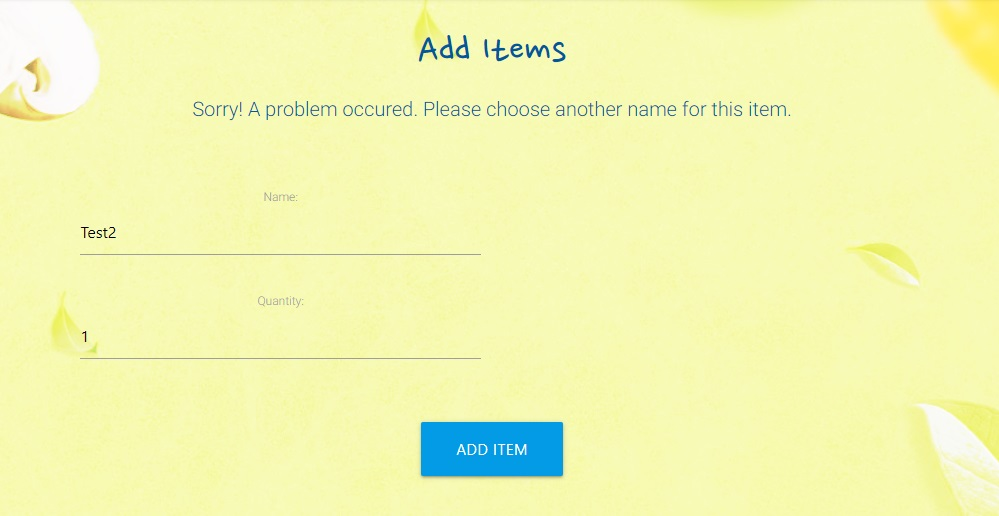

# Testing


##  **Responsiveness**
- The project was responsive tested on https://ui.dev/amiresponsive and it is responsive for every type of devices such as desktop computers, laptops, tablets and smart phones.


## **Code Validator Testing**

- ### **HTML**

    No errors were detected when passing through the [W3C validator](https://validator.w3.org/nu/) for the most of templates used in the project.

    Except of *login.html* template and *edit_item* template. Both templates are using material_forms implemented form django_material. This generates: Attribute for not allowed on element span at this point Error. 

    - Edit Item Page:

        

        

    - Edit Item Page:

        

        

    The rest of the html Templates are error free.

    - Home Page:

        

        

    - Lists Page:

        

    - Items Page:

        

    - Edit List Template:

        

    - About Page:

        

    - Register Page:

        

    - Logout Page:

        

        


    * Link to the validation testing for my Html file:
    https://validator.w3.org/nu/?doc=https%3A%2F%2Ftw-shopping-list.herokuapp.com%2F

- ### **CSS**
    * No errors were detected when passing through the [jigsaw.w3 validator](https://jigsaw.w3.org/css-validator). 

         
    

- ### **JAVASCRIPT**
   
    * No errors were detected when passing through the jshint validator.

         

- ### **PYTHON**

     No error detected when passing the following file through the CI Python Linter:

    - views.py:

        

    - admin.py 

        

    - forms.py

        

    - models.py

        

    - list/urls.py

        

    - shopping/urls.py

        


## **Browsers compatibility**

- The Web Page is compatibile with every tested browser and fully responsive in the full range of screen sizes:

    * **Google Chrome:**

    

    


    * **Microsoft Edge:**
    
    

    


    * **Avast Browser:** 

    

    


    * **Netbox Browser:**

    

    


    * **Mobile Devices:**

    
    
    

## **Lighthouse Inspection reports**
 - There are some issues when the page is opening using Google **Chrome browser**.
    
    However the page inspection in Incognito Mode without any browser extensions shows results as follows



    Results are similar for all the pages. 

    Although there are some differences between displaying the page on different browsers.

**Microsoft Edge:**


And a less popular **Netbox Browser**:


## **Testing Functionalities:**

User Stories Tests:
* As a user I can mark an Item on the list as Urgent so that the Item will be moved to the top of the list or highlighted with a different color
* As a the application user I can create and add items to the shopping list so that the items can be displayed and marked as Done/Bought. [Link to tests](#add-item)
* As a an application user I can mark an item as Bought so that the item will be moved to the botton of the list or removed from the list [Link to tests](#item-functionalities-testings)
* As a user I can register and login so that I can receive access to additional functions. [Link to test](#authentication)
* As a user I can Edit items already added to the list so that udpade items names and change quantity of the items [Link to test](#edit-item)
* As a user I can remove items from the list so that I don't have to store unwanted items on my shopping list [Link to test](#delete-item)
* As a user I can remove all existing items at one click so that I can quickly remove one list and build a new one. [Link to test](#clear-list)

### Home Page:


### **Authentication:**

The user is able to register an account. After creating the account the user is able to Login and Logout from his account.
Logged in users gets access to all the application functions.

### Register a new account:

To create a new account enter the Register page and fill up the form which includes:
- User Name
- Email
- Password
- Repeated Password


After filling up the form correctly and clicking "Sign Up" button the account is created 
and the user is redirected to the Home Page where the information about successful
register hould be dispayed.


### Login:

Users who already have their accounts can login in the Login Page.


Filling up the form correctly and clicking "Sign Up" button redirects the user to the Home Page.
Entering invalid data or not entering required data displays wqrning message.


### Logout:

To being logout the user should go to the Logout Page and after clicking "Sign Out" he is logged out and redirected to the Home Page.
Also information about being logged out is displayed.


### **Testing Lists functionalities:**

Creating shopping lists is one of the main functions of this application.


### Add List

To create a new List go to the Lists Page and click "Add New List" button.


After naming the new list click "Create List" button to create the list.


If the list name was successfully validated the user will be redirected to the Lists view page.


In case of unsuccessful validation a warning message is displayed.


Also a handled Integrity Error can occured during adding a new List.

More information about the error in the Bugs and Errors section [here](README.md#7-bugs-and-errors).


### Show Lists

Created lists are displayed in the Lists Page.

### Edit List

To change the list name click the "Edit" button on the list card. Enter the new name and submit changes clicking the "Submit Changes" button.
In case of successful validation the user will be redirected to the Lists page.
If the input in validated successfully a warning message is displayed.


### Delete List

To delete a list click the "Delete" button on the list card. A confirmation window will be displayed.

Clicking "Yes" button the user submits deleting the list and its all items from the database.

Clicking "No" cancel the operation and redirects the user back to the Lists Page.


Deleting the list redirects the user to the Lists Page where information about deleting list is displayed.


### **Testing Items functionalities:**

Adding and and manipulationg items is the main function this application. In this section I'm going to test Add, Edit and Delete functions as well as changing items status from "to buy" to "bought".


### Add Item

To create a new Item go to the Lists Page and click "Add Item" button.
Fill up the form which includes:

Required field
- Item Name
- Quantity (with default value 1)

Optional fields:
- Price
- Description
- Favourite checkbox
- Urgent checkbox

After filling up the form click "Add Item" button to create the item and add it to the list.

If the all form fields were successfully validated the user will be redirected to the List view.

In case of unsuccesful validation a warning message is displayed.


### Edit Item

To update Item informations go to the Lists Page and click over the item card and click "Edit Item" button.
Override the information in the form and click "Submit" button:


If the all form fields were successfully validated the user will be redirected to the List view.

In case of unsuccesful validation a warning message is displayed.


### Delete Item

To delete an item click over the item card to display function button click the "Delete" button. A confirmation window will be displayed.

Clicking "Yes" button the user submits deleting the item.

Clicking "No" cancel the operation and redirects the user back to the Lists view.


Deleting the item redirects the user to the Lists view where information about deleting the item is displayed.


### Clear List

To delete all the items from the list click "Delete All" button.
A confirmation window will be displayed.

Clicking "Yes" button the user submits deleting the items.

Clicking "No" cancel the operation and redirects the user back to the List view.


 ### Item Functionalities Testings

To move item to the "bought items list" click round green button on the left side of the item card.
The "bought" items list will be created and the clicked item will be moved to the list.

Bought items can be moved back to the items to buy list when clicked again.

 

 

 


## **7. Bugs and Errors**

A number of bugs and error occured during the developement 

### **Checkbox issue**

A problem occured when I tried to display forms using Materialize templates. 
The template did not display checkboxes correctly in all of my forms.



The solution turned out to be instaling Material and displaying the forms as Material forms:


For more detail about how to fix this bug click here: https://stackoverflow.com/questions/54500348/django-checkbox-not-showing-up-in-html



### **Integrity Error**

A problem occured during updating items and lists.
Edit Items function doesn't update the elements slug.
So if you update items name from item1 to item2, the items slug will still be item1.
If you try to add a new item named item1 it will cause Integrity Error beacuse of duplicating slugs.


I've temporarily solved the problem with handling the error with try/catch statement. 
It would be useful to add slugs update functionality to Edit Items and Edit Lists functions.

```python
try:
    if item_form.is_valid():
        item_form.instance.slug = slugify(request.POST.get("name"))
        item_form.instance.list_name = list
        item_form.save()
        return redirect(reverse("show_list_items", args=[list.slug]))
    except IntegrityError as e:
        messages.error(request, f"Sorry! A problem occured. Please choose another name for this item.")
```




## **Unfixed Bugs**

### Attribute for not allowed on element span at this point Error

An error that comes from material_form which is implemented from django-material package.
More detail about this error in the Html validation testing section 
[Here](#code-validator-testing)

### Not Found Favicon.ico


Not found favicon.ico status 404 shows during the start of the application.
Have solved this problem following the instruction I found in Stack Overflow:
https://stackoverflow.com/questions/31075893/im-getting-favicon-ico-error

### Not Found Robots.txt


Not found robots.txt show during tha Lighthouse inspection.

