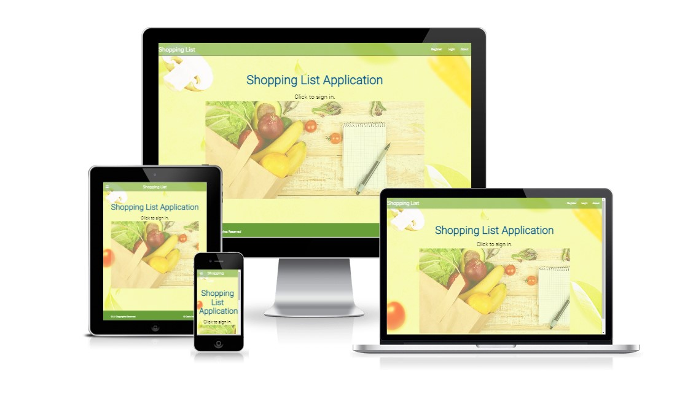

# Testing

##  **Responsiveness**
- The project was responsive tested on https://ui.dev/amiresponsive and it is responsive for every type of devices such as desktop computers, laptops, tablets and smart phones.

## **Code Validator Testing**
- HTML
    * No errors were detected when passing through the [W3C validator](https://validator.w3.org/nu/).
    .
    * Link to the validation testing for my Html file:
    https://validator.w3.org/nu/?doc=https%3A%2F%2Ftomaszwoloszyn983.github.io%2Fswap-puzzle-game

- CSS
    * No errors were detected when passing through the [jigsaw.w3 validator](https://jigsaw.w3.org/css-validator). 

         
    
   

- JAVASCRIPT
   
No test yet.

- PYTHON

No test yet.

## **Browsers compatibility**
- The Web Page is compatibile with every tested browser, such as:
    * Google Chrome:

         

    * Microsoft Edge: 
    
       

    * Avast Browser: 

        

    * Netbox Browser:

        

## **Lighthouse Inspection reports**
 - There are some issues when the page is opening using Google Chrome browser.

    * 

    However inspecting the page in Incognito Mode without any browser extensions shows results as follows

    * 

    Making Lighthouse inspections using different browsers show very similar results. 
    
    * 

    This is an example of Lighthouse inspection in Microsort Edge browser made using inPrivate mode.

## **Testing Functionalities:**

User Stories Tests:
* As a user I can mark an Item on the list as Urgent so that the Item will be moved to the top of the list or highlighted with a different color
* As a the application user I can create and add items to the shopping list so that the items can be displayed and marked as Done/Bought
* As a an application user I can mark an item as Bought so that the item will be moved to the botton of the list or removed from the list
* As a user I can register and login so that I can receive access to additional functions.
* As a user I can **Edit items already added to the list ** so that udpade items names and change quantity of the items
* As a user I can remove items from the list so that I don't have to store unwanted items on my shopping list
* As a user I can **remove all existing items at one click ** so that I can quickly remove one list and build a new one.

### Home Page:

### **Authentication:**

The user is able to register an account. After creating the account the user is able to Login and Logout from his account.
Logged in users gets access to all the application functions.

### Register a new account:

To create a new account enter the Register page and fill up the form which includes:
- User Name
- Email
- Password
- Repeated Password

After filling up the form correctly and clicking "Sign Up" button the account is created 
and the user is redirected to the Home Page where the information about successful
register hould be dispayed.

### Login:

Users who already have their accounts can login in the Login Page.

Filling up the form correctly and clicking "Sign Up" button redirects the user to the Home Page.
Entering invalid data or not entering required data displays wqrning message.

### Logout:

To being logout the user should go to the Logout Page and after clicking "Sign Out" he is logged out and redirected to the Home Page.
Also information about being logged out is displayed.

### **Testing Lists functionalities:**

Creating shopping lists is one of the main functions of this application.

### Add List

To create a new List go to the Lists Page and click "Add New List" button.

After naming the new list click "Create List" button to create the list.

If the list name was successfully validated the user will be redirected to the Lists view page.

In case of unsuccessful validation a warning message is desplayed.

Also a handled Integrity Error can occured during adding a new List.

More information about the error in the Bugs and Errors section [here](README.md#7-bugs-and-errors).

### Show Lists

Created lists are displayed in the Lists Page.

### Edit List

To change the list name click the "Edit" button on the list card. Enter the new name and submit changes clicking the "Submit Changes" button.
In case of successful validation the user will be redirected to the Lists page.
If the input in validated successfully a warning message is displayed.

### Delete List

To delete a list click the "Delete" button on the list card. A confirmation window will be displayed.

Clicking "Yes" button the user submits deleting the list and its all items from the database.

Clicking "No" cancels hte operation and redirects the user back to the Lists Page.

Deleting the list redirects the user to the Lists Page.

### **Testing Items functionalities:**

Adding and managing items is the main function this application. In this section I'm going to test Add, Edit and Delete functions as well as changing items status from "to buy" to "bought"

### Add Item

### Edit Item

### Delete Itme

### Show Items

 ### Item Functionalities Testings

## **Unfixed Bugs**
